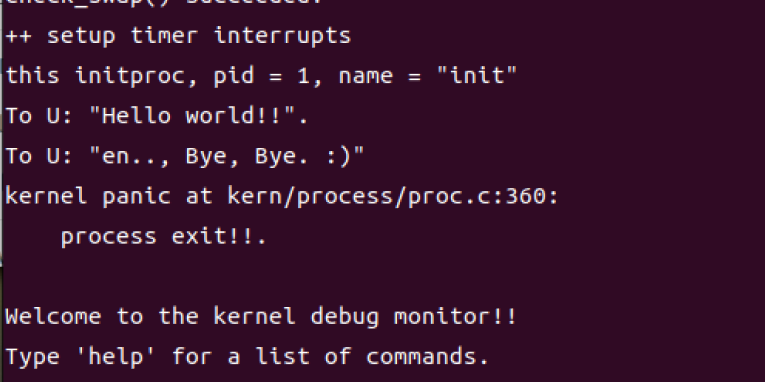
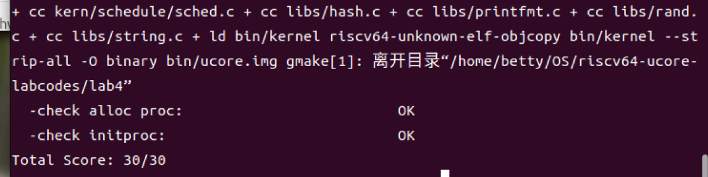

# Lab4

# 操作系统课程实验报告

# **实验名称：Lab4 进程管理**

**小组成员： 2113388 高涵 2112849 唐静蕾 2113999 陈翊炀**

## 一、实验目的

实验 2/3 完成了物理和虚拟内存管理，这给创建内核线程（内核线程是一种特殊的进程）打下了提供内存管理的基础。当一个程序加载到内存中运行时，首先通过 ucore OS 的内存管理子系统分配合适的空间，然后就需要考虑如何分时使用 CPU 来“并发”执行多个程序，让每个运行的程序（这里用线程或进程表示）“感到”它们各自拥有“自己”的 CPU。

本次实验将首先接触的是内核线程的管理。内核线程是一种特殊的进程，内核线程与用户进程的区别有两个：

- 内核线程只运行在内核态
- 用户进程会在在用户态和内核态交替运行
- 所有内核线程共用 ucore 内核内存空间，不需为每个内核线程维护单独的内存空间
- 而用户进程需要维护各自的用户内存空间

本次实验主要的实验目的是：

- 了解内核线程创建/执行的管理过程
- 了解内核线程的切换和基本调度过程

## 二、实验内容

#### **练习 1：分配并初始化一个进程控制块**

> alloc_proc 函数（位于 kern/process/proc.c 中）负责分配并返回一个新的 struct proc_struct 结构，用于存储新建立的内核线程的管理信息。ucore 需要对这个结构进行最基本的初始化，你需要完成这个初始化过程。
>
> - 请说明 proc_struct 中 `struct context context` 和 `struct trapframe *tf` 成员变量含义和在本实验中的作用是啥？

```json
// alloc_proc - alloc a proc_struct and init all fields of proc_struct
static struct proc_struct *
alloc_proc(void) {
    struct proc_struct *proc = kmalloc(sizeof(struct proc_struct));
    if (proc != NULL) {
    //LAB4:EXERCISE1 YOUR CODE
    /*
     * below fields in proc_struct need to be initialized
     *       enum proc_state state;                      // Process state
     *       int pid;                                    // Process ID
     *       int runs;                                   // the running times of Proces
     *       uintptr_t kstack;                           // Process kernel stack
     *       volatile bool need_resched;                 // bool value: need to be rescheduled to release CPU?
     *       struct proc_struct *parent;                 // the parent process
     *       struct mm_struct *mm;                       // Process's memory management field
     *       struct context context;                     // Switch here to run process
     *       struct trapframe *tf;                       // Trap frame for current interrupt
     *       uintptr_t cr3;                              // CR3 register: the base addr of Page Directroy Table(PDT)
     *       uint32_t flags;                             // Process flag
     *       char name[PROC_NAME_LEN + 1];               // Process name
     */
        proc->state = PROC_UNINIT;      // 进程状态“初始态”
        proc->pid = -1;                 // 进程号未初始化值
        proc->runs = 0;                 // 运行次数
        proc->kstack = 0;               // 内核栈
        proc->need_resched = 0;         // 是否需要调度器调度
        proc->parent = NULL;            // 父进程（没有）
        proc->mm = NULL;                // 内存管理
        memset(&(proc->context), 0, sizeof(struct context));//进程上下文
        proc->tf = NULL;                // Trap Frame
        proc->cr3 = boot_cr3;           // cr3-内核页目录表的基址
        proc->flags = 0;                // 进程标志位
        memset(proc->name, 0, PROC_NAME_LEN);               //进程名

    }
    return proc;
}
```

**struct context context****和****struct trapframe *tf****成员变量含义：**

- `context`：`context` 中保存了进程执行的上下文，也就是几个关键的寄存器（`ra`，`sp`，`s0~s11` 共 14 个寄存器）的值。这些寄存器的值用于在进程切换中还原之前进程的运行状态。切换过程的实现在 `kern/process/switch.S`。
- `tf`：`tf` 里保存了进程的中断帧。当进程从用户空间跳进内核空间的时候，进程的执行状态被保存在了中断帧中（注意这里需要保存的执行状态数量不同于上下文切换）。系统调用可能会改变用户寄存器的值，我们可以通过调整中断帧来使得系统调用返回特定的值。

**在本实验中的作用：**

- 首先是对二者的初始化：`context` 初始化为 0，`tf` 初始化为 NULL 空指针；

```
_// in proc.c allocpage _
 memset(&(proc->context),0,sizeof(struct context)); 
 proc->tf = NULL;
```

- 在 `kernel_thread` 中初始化并设置对应的寄存器和字段地址对应的值：

```
int kernel_thread(int (*fn)(void *), void *arg, uint32_t clone_flags) {
    struct trapframe tf;
    
    // 初始化 trapframe 结构体
    memset(&tf, 0, sizeof(struct trapframe));
    
    // 设置 trapframe 中的寄存器
    tf.gpr.s0 = (uintptr_t)fn;   // 将函数指针 fn 转换为 uintptr_t 类型，并赋值给寄存器 s0
    tf.gpr.s1 = (uintptr_t)arg;  // 将参数指针 arg 转换为 uintptr_t 类型，并赋值给寄存器 s1
    
    // 设置 trapframe 中的状态寄存器
    tf.status = (read_csr(sstatus) | SSTATUS_SPP | SSTATUS_SPIE) & ~SSTATUS_SIE;
    // 从 sstatus 寄存器读取当前状态，并设置 SPP（Supervisor Previous Privilege）和 SPIE（Supervisor Previous Interrupt Enable）位，
    // 并关闭 SIE（Supervisor Interrupt Enable）位，然后将结果赋值给 trapframe 的 status 字段
    
    // 设置 trapframe 的 epc 字段为 kernel_thread_entry 函数的地址
    tf.epc = (uintptr_t)kernel_thread_entry;
    
    // 调用 do_fork 函数，创建一个新进程，并传递 clone_flags 和 trapframe 的地址作为参数
    return do_fork(clone_flags | CLONE_VM, 0, &tf);
}
```

- 对应的 `kernel_thread_entry`：

```
.text
.globl kernel_thread_entry

kernel_thread_entry:        # 内核线程入口点（void kernel_thread(void)）
        move a0, s1        # 将寄存器 s1 的值移动到寄存器 a0，作为参数传递给下一条指令的目标函数
        jalr s0            # 通过 jalr 指令跳转到寄存器 s0 中存储的函数地址，即调用 fn 函数

        jal do_exit        # 调用 do_exit 函数，结束当前线程
```

- 最后调用 `do_fork()` 函数将 tf 对应的值写进即将被调用的线程中：

具体代码及解释见练习 2，只要是通过 `copy_thread(proc,stack,tf);` 实现。

- 对于 `context`，主要是在线程调度中使用 `schedule()` 函数实现，经过调用最终在 `proc_run` 中我们进⾏了调度，其中保存了 `satp`（也就是 Windows x86 的 `cr3`）寄存器 `lcr3(next->cr3);`，并调⽤ `switch_to` 函数对 `context` 进⾏切换。保存正在运⾏的现场，恢复之前的状态。具体在练习 3 中体现。
- 对于寄存器的保存切换，具体在 Switch.s 中包装了 `void switch_to(struct proc_struct* from, struct proc_struct* to)` 函数实现对寄存器状态的切换，将 from 的保存，to 的恢复，实现切换：

```
#include <riscv.h>

.text
# void switch_to(struct proc_struct* from, struct proc_struct* to)
.globl switch_to
switch_to:
    # save from's registers
    STORE ra, 0*REGBYTES(a0)
    STORE sp, 1*REGBYTES(a0)
    STORE s0, 2*REGBYTES(a0)
    STORE s1, 3*REGBYTES(a0)
    STORE s2, 4*REGBYTES(a0)
    STORE s3, 5*REGBYTES(a0)
    STORE s4, 6*REGBYTES(a0)
    STORE s5, 7*REGBYTES(a0)
    STORE s6, 8*REGBYTES(a0)
    STORE s7, 9*REGBYTES(a0)
    STORE s8, 10*REGBYTES(a0)
    STORE s9, 11*REGBYTES(a0)
    STORE s10, 12*REGBYTES(a0)
    STORE s11, 13*REGBYTES(a0)

    # restore to's registers
    LOAD ra, 0*REGBYTES(a1)
    LOAD sp, 1*REGBYTES(a1)
    LOAD s0, 2*REGBYTES(a1)
    LOAD s1, 3*REGBYTES(a1)
    LOAD s2, 4*REGBYTES(a1)
    LOAD s3, 5*REGBYTES(a1)
    LOAD s4, 6*REGBYTES(a1)
    LOAD s5, 7*REGBYTES(a1)
    LOAD s6, 8*REGBYTES(a1)
    LOAD s7, 9*REGBYTES(a1)
    LOAD s8, 10*REGBYTES(a1)
    LOAD s9, 11*REGBYTES(a1)
    LOAD s10, 12*REGBYTES(a1)
    LOAD s11, 13*REGBYTES(a1)

    ret
```

#### **练习 2：为新创建的内核线程分配资源**

> 创建一个内核线程需要分配和设置好很多资源。kernel_thread 函数通过调用 **do_fork** 函数完成具体内核线程的创建工作。do_kernel 函数会调用 alloc_proc 函数来分配并初始化一个进程控制块，但 alloc_proc 只是找到了一小块内存用以记录进程的必要信息，并没有实际分配这些资源。ucore 一般通过 do_fork 实际创建新的内核线程。do_fork 的作用是，创建当前内核线程的一个副本，它们的执行上下文、代码、数据都一样，但是存储位置不同。因此，我们**实际需要"fork"的东西就是 stack 和 trapframe**。在这个过程中，需要给新内核线程分配资源，并且复制原进程的状态。你需要完成在 kern/process/proc.c 中的 do_fork 函数中的处理过程
> 请在实验报告中简要说明你的设计实现过程。请回答如下问题：
>
> - 请说明 ucore 是否做到给每个新 fork 的线程一个唯一的 id？请说明你的分析和理由。

```javascript
int
do_fork(uint32_t clone_flags, uintptr_t stack, struct trapframe *tf) {
    int ret = -E_NO_FREE_PROC;
    struct proc_struct *proc;
    if (nr_process >= MAX_PROCESS) {
        goto fork_out;
    }
    ret = -E_NO_MEM;
    //    1. call alloc_proc to allocate a proc_struct
    if((proc=alloc_proc())==NULL){
         goto fork_out;
    }
    proc->parent=current;
    //    2. call setup_kstack to allocate a kernel stack for child process
     if (setup_kstack(proc) != 0) {
        goto bad_fork_cleanup_proc;
    }
    
    //    3. call copy_mm to dup OR share mm according clone_flag
    if (copy_mm(clone_flags, proc) != 0) {
        goto bad_fork_cleanup_kstack;
    }
    //    4. call copy_thread to setup tf & context in proc_struct
    copy_thread(proc,stack,tf);
    //    5. insert proc_struct into hash_list && proc_list
     bool intr_flag;
    local_intr_save(intr_flag);
    {
        proc->pid = get_pid();
        hash_proc(proc);
        list_add(&proc_list, &(proc->list_link));
        nr_process ++;
    }
    local_intr_restore(intr_flag);
    //    6. call wakeup_proc to make the new child process RUNNABLE
    wakeup_proc(proc);
    //    7. set ret vaule using child proc's pid
    ret=proc->pid;
   
fork_out:
    return ret;

bad_fork_cleanup_kstack:
    put_kstack(proc);
bad_fork_cleanup_proc:
    kfree(proc);
    goto fork_out;
}
```

- 根据 `get_pid（）` 函数的实现，它确保了为每个新 fork 的线程分配一个唯一的 pid。

`get_pid（）`：

```python
static int
get_pid(void) {
    static_assert(MAX_PID > MAX_PROCESS);
    struct proc_struct *proc;
    list_entry_t *list = &proc_list, *le;
    static int next_safe = MAX_PID, last_pid = MAX_PID;
    if (++ last_pid >= MAX_PID) {
        last_pid = 1;
        goto inside;
    }
    if (last_pid >= next_safe) {
    inside:
        next_safe = MAX_PID;
    repeat:
        le = list;
        while ((le = list_next(le)) != list) {
            proc = le2proc(le, list_link);
            if (proc->pid == last_pid) {
                if (++ last_pid >= next_safe) {
                    if (last_pid >= MAX_PID) {
                        last_pid = 1;
                    }
                    next_safe = MAX_PID;
                    goto repeat;
                }
            }
            else if (proc->pid > last_pid && next_safe > proc->pid) {
                next_safe = proc->pid;
            }
        }
    }
    return last_pid;
}
```

- 具体实现过程如下：

  ```
          1.静态变量 last_pid 和 next_safe 用于记录当前已分配的pid和下一个安全的pid值。

          2.函数会递增 last_pid 的值，并将其与 next_safe 比较，如果 last_pid 超过或等于 next_safe，则重新                 设置 next_safe 为 MAX_PID 并遍历已有的进程，寻找未被占用的pid值。

          3.在遍历过程中，如果发现有进程占用了当前的 last_pid，则会继续尝试下一个pid值，直到找到一个未                被占用的pid为止。

          4.如果遍历到列表末尾仍未找到未被占用的pid，那么会重新从第一个pid开始寻找。
  ```

根据函数实现的逻辑我们知道可以确保为每个新的 fork 的线程分配一个唯一的 pid

- 部分代码详解：
  - `static_assert(MAX_PID > MAX_PROCESS)`：一个静态断言，确保 MAX_PID（系统允许的最大进程 ID）大于 MAX_PROCESS（系统允许的最大进程数量）。这是为了防止在系统达到其最大进程容量时出现错误。
  - `list_entry_t *list = &proc_list, *le`：定义两个指向 list_entry_t 类型的指针，一个用于存储进程列表的地址，另一个用于遍历该列表
  - `if (++ last_pid >= MAX_PID) { last_pid = 1; goto inside; }`：如果最后使用的进程 ID 增加到或超过 MAX_PID，将 last_pid 重置为 1，并跳转到标签 inside，将 next_safe 设置为 MAX_PID
  - 如果最后使用的进程 ID 大于或等于下一个安全的进程 ID，则将 next_safe 设置为 MAX_PID，然后遍历进程列表，查找与最后使用的进程 ID 相同的进程。如果找到，增加 last_pid，直到找到一个大于 last_pid 但小于 next_safe 的进程 ID。然后将 next_safe 更新为这个新的进程 ID

#### **练习 3：编写 proc_run 函数**

> proc_run 用于将指定的进程切换到 CPU 上运行。它的大致执行步骤包括：
> 1.检查要切换的进程是否与当前正在运行的进程相同，如果相同则不需要切换。
> 2.禁用中断。你可以使用 `/kern/sync/sync.h` 中定义好的宏 `local_intr_save(x)` 和 `local_intr_restore(x)` 来实现关、开中断。
> 3.切换当前进程为要运行的进程。
> 4.切换页表，以便使用新进程的地址空间。`/libs/riscv.h` 中提供了 `lcr3(unsigned int cr3)` 函数，可实现修改 CR3 寄存器值的功能。
> 5.实现上下文切换。`/kern/process` 中已经预先编写好了 `switch.S`，其中定义了 `switch_to()` 函数。可实现两个进程的 context 切换。
> 6.允许中断。
> 请回答如下问题：
>
> - 在本实验的执行过程中，创建且运行了几个内核线程？

**proc_run**** 函数实现如下：**

```cpp
void proc_run(struct proc_struct *proc) {
    if (proc != current) {
        bool intr_flag;
        struct proc_struct *prev = current, *next = proc;
        local_intr_save(intr_flag);
        {
            current = proc;
            lcr3(next->cr3);
            switch_to(&(prev->context), &(next->context));
        }
        local_intr_restore(intr_flag);
    }
}
```

`proc_run` 函数用于在内核中切换到指定进程，函数的详细解析如下：

- **判断当前进程是否为目标进程**：首先，函数会检查当前运行的进程是否已经是目标进程，如果是，则无需进行切换，直接返回。这个检查可以避免不必要的上下文切换。
- **保存中断状态并进行上下文切换**：如果当前进程不是目标进程，函数会保存当前中断状态（`local_intr_save(intr_flag);`），然后进行上下文切换。上下文切换的步骤如下：

  - `current = proc;`：将当前进程指针指向目标进程，表示切换到目标进程执行。
  - `lcr3(next->cr3);`：切换页目录表，将 CR3 寄存器设置为目标进程的页目录表基址，以确保进程的虚拟地址空间正确映射。
  - `switch_to(&(prev->context), &(next->context));`：调用 `switch_to` 函数实现上下文切换，将前一个进程的上下文保存到 `prev->context`，并将目标进程的上下文加载到 CPU 寄存器中，使得处理器从当前进程切换到目标进程。
- **恢复中断状态**：在上下文切换完成后，函数会恢复之前保存的中断状态（`local_intr_restore(intr_flag);`），确保中断处理正常进行。

> 在本实验的执行过程中，创建且运行了几个内核线程？

在本实验中，一共创建了两个内核线程：

- **第 0 个内核线程 idleproc  **在 `init.c/kern_init` 函数中，调用了 `proc_init` 函数，该函数启动了创建内核线程的步骤。当前执行上下文（从 `kern_init` 启动开始）被视为 uCore 内核中的一个内核线程的上下文。为了实现这一点，ucore 通过给当前执行的上下文分配一个进程控制块，并对其进行相应的初始化，从而将其打造成第 0 个内核线程，也即 `idleproc`。这个过程包括了创建进程控制块、初始化相关数据结构等步骤，使得当前执行上下文能够在 uCore 内核中被视为一个内核线程。
- **第 1 个内核线程 initproc  **第 0 个内核线程的主要任务是完成 uCore 内核中各个子系统的初始化工作，然后通过执行 `cpu_idle` 函数进入休眠状态。由于 `idleproc` 内核子线程本身不愿意继续处理其他任务，所以通过调用 `kernel_thread` 函数创建了一个内核线程 `init_main`。在本次实验中，`init_main` 的任务是输出一些字符串后返回，充当一个初始工作的内核线程。然而，在后续的实验中，`init_main` 将承担创建特定的其他内核线程或用户进程的职责。这个过程体现了内核通过创建新的内核线程来完成不同任务，实现系统的模块化和扩展性。

在补充完函数后，执行 make qemu 验证如下：



Make grade 的结果如下：



#### **Challenge：**说明语句 `local_intr_save(intr_flag);....local_intr_restore(intr_flag);` 是如何实现开关中断的？

`__intr_save` 函数：

```python
static inline bool __intr_save(void) {
 if (read_csr(sstatus) & SSTATUS_SIE) {
 intr_disable();
 return 1;
 }
 return 0;
 }
```

该函数的目的是检查并禁用中断，它通过读取 `sstatus` 寄存器的值来确定中断是否处于使能状态。如果处于使能状态，调用 `intr_disable()` 函数来禁用中断，并返回 `1` 表示原本是使能的。如果中断已经禁止，直接返回 `0` 表示原本是禁止的。此函数可用于保护临界区，确保在临界区内部不受中断的干扰。实现逻辑如下：

1. 首先，使用 `read_csr(sstatus)` 读取当前状态寄存器 `sstatus` 的值。
2. 使用按位与操作符 `&` 将 `sstatus` 的值与 `SSTATUS_SIE` 进行按位与操作。`SSTATUS_SIE` 是一个掩码，用于检查中断使能位。
3. 如果按位与的结果非零，表示当前中断是使能的，进入 `if` 语句块，调用 `intr_disable()` 函数来禁用中断，返回值 `1`，表示中断原本是使能的，并已经禁用。
4. 如果按位与的结果为零，表示当前中断是禁止的，跳过 `if` 语句块，返回值 `0`，表示中断原本是禁止的。

`__intr_restore` 函数：

```python
static inline void __intr_restore(bool flag) {
 if (flag) {
 intr_enable();
 }
 }
```

该函数的目的是根据传入的 `flag` 值来决定是否恢复中断。如果 `flag` 为真，调用 `intr_enable()` 函数来重新使能中断。如果 `flag` 为假，表示在调用 `__intr_save` 函数时中断原本就是禁止的，因此无需执行任何操作。实现逻辑如下：

1. 接受一个布尔值参数 `flag`，表示需要恢复中断的标志。
2. 如果 `flag` 为真（非零），进入 `if` 语句块，调用 `intr_enable()` 函数来重新使能中断。
3. 如果 `flag` 为假（零），跳过 `if` 语句块，不执行任何操作。

在实验中通过成对调用 `local_intr_save(intr_flag);` 和 `local_intr_restore(intr_flag);`，可以实现对临界区的保护，确保在临界区内部不会发生中断，从而提供了可靠的同步和互斥机制。
